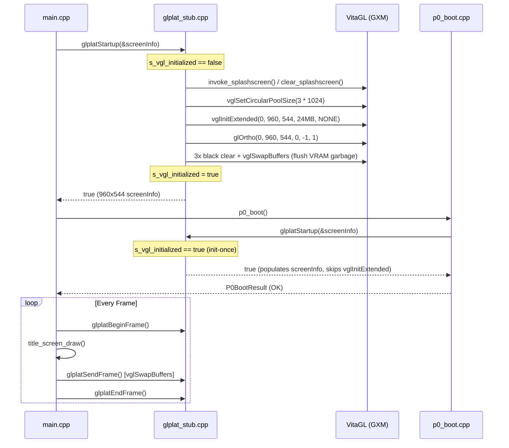

# Unit 4 Digest: VitaGL Present Path & glplat Implementation

## 1. Overview

Unit 4 replaces the initial no-op `glplat*` frame functions in `vita/src/plat/gx/glplat_stub.cpp` with a real VitaGL present path (`glplatPreStartup`, `Startup`, `PostStartup`, `BeginFrame`, `EndFrame`, `SendFrame`, `Finish`, `AbortFrame`).

This establishes native PS Vita (960×544) display initialization, clean frame presentation (`vglSwapBuffers`), and clear-to-color/depth pipelines conforming to the platform graphics ABI defined in `include/NL/gl/glPlat.h` and `vita/include/plat_abi.h`.

---

## 2. vglInit Ownership Decision & Architecture

### Decision: glplat Owns Init, Main Calls Startup First

The ownership model was selected as: **`glplat` owns VitaGL initialization, and `main` must call `glplatStartup` first**, guarded by an internal `s_vgl_initialized` init-once boolean.

### Rationale:
1. **Architectural Separation of Concerns:** In the Super Mario Strikers decomp architecture, `glplat` (`include/NL/gl/glPlat.h`) is the graphics platform abstraction layer. Low-level GPU context creation (`vglInitExtended`), pool sizing, projection setup, and swap chain management belong inside `glplat`, not in entry point application code.
2. **Idempotent Multi-Caller Safety:** `p0_boot()` tests `glplatStartup`, and subsequent engine startup code (`src/Game/main.cpp` -> `glStartup()` -> `glplatStartup()`) will call it again. The `s_vgl_initialized` guard ensures that any subsequent caller safely receives the native screen configuration without triggering a double-init crash or warning in VitaGL.
3. **Decoupled Application Layer:** `main.cpp` no longer needs `#include <vitaGL.h>` or direct `vglSwapBuffers` calls. The main loop controls presentation purely via `glplatBeginFrame()`, `glplatSendFrame()`, `glplatEndFrame()`, and `glplatFinish()`.

---

## 3. Function-by-Function Implementation

All functions are implemented in `vita/src/plat/gx/glplat_stub.cpp`:

| Function | Implementation Details | Status / Rationale |
| :--- | :--- | :--- |
| **`glplatPreStartup`** | Returns `true`. Pre-startup hook matching GC `nlInit`/`glplatPreStartup` call order. Early setup is consolidated in `glplatStartup`. | Active hook. |
| **`glplatStartup`** | Populates `gl_ScreenInfo` with 960×544 resolution, 32-bit RGBA, 24-bit Z-depth. Initializes VitaGL (`vglInitExtended`) on first run, configures default ortho projection, and flushes 3 black backbuffers. Subsequent calls populate `screenInfo` and return `true` immediately. | Active implementation with init-once guard. |
| **`glplatPostStartup`** | Returns `true`. In GameCube SMS, this initialized `glxPostInitTargets`. Full GX render targets and TEV pipelines are deferred to Phase 7. | Stub with clear comment. |
| **`glplatBeginFrame`** | Prepares frame state: disables scissor test, sets viewport to (0, 0, 960, 544), clears color buffer to black and depth buffer to 1.0f. | Active presentation path. |
| **`glplatEndFrame`** | No-op. On GameCube NL, `glplatEndFrame` marked completion of geometry submission (`gl_state = 2`), while buffer swap was executed in `glplatSendFrame`. On VitaGL, swap remains in `SendFrame`. | Active boundary hook with clear comment. |
| **`glplatSendFrame`** | Executes `vglSwapBuffers(GL_FALSE)` to present the backbuffer to the physical display. | Active presentation path. |
| **`glplatFinish`** | Executes `glFinish()` to block until all pending GPU commands complete (matching GC `glxSwapWaitDrawDone`). | Active GPU sync path. |
| **`glplatAbortFrame`** | Executes `glFinish()` without buffer swap to discard in-flight rendering (matching GC `glplatAbortFrame`). | Active discard path. |

---

## 4. Preservation of Splash Screen & Stubs

- **Splashscreen Stubs Kept:** `vita/src/plat/gx/vgl_splash_stub.c` remains linked directly as an object in `CMakeLists.txt`.
- Inside `glplatStartup`, `invoke_splashscreen()` and `clear_splashscreen()` are invoked. Because `vgl_splash_stub.c` defines `is_splashscreen_active = 0` and dummy mutexes, VitaGL's internal background splash thread is never spawned, preserving crash-free boot on Vita3K and physical hardware.

---

## 5. Files Changed

1. **`vita/src/plat/gx/glplat_stub.cpp`**:
   - Replaced empty stubs with full VitaGL initialization, init-once guard, screen info configuration (960×544), 3-buffer startup flush, and frame presentation (`glplatBeginFrame`, `glplatSendFrame`, `glplatEndFrame`, `glplatFinish`, `glplatAbortFrame`).
2. **`vita/src/main.cpp`**:
   - Removed local `init_vgl()`, `invoke_splashscreen()`, and `clear_splashscreen()` definitions.
   - Removed `#include <vitaGL.h>`.
   - Wired `main()` to initialize graphics via `glplatPreStartup()`, `glplatStartup(&screenInfo)`, and `glplatPostStartup()`.
   - Replaced direct `vglSwapBuffers(GL_FALSE)` in the main loop with `glplatBeginFrame()`, `title_screen_draw(...)`, `glplatSendFrame()`, and `glplatEndFrame()`.
   - Added `glplatFinish()` at loop exit.
   - Preserved Unit 7 `vita_game_boot()` trigger on Start/Z button press.
3. **`vita/include/plat_abi.h`**:
   - Added `void glplatAbortFrame(void);` declaration matching `include/NL/gl/glPlat.h`.
4. **`vita/docs/agy4_glplat.md`**:
   - Created this digest document.

---

## 6. Verification & Build Results

Executed `cmake --build build/vita`:
- `smstrikers_vita` linked cleanly against `libvitaGL.a` and VitaSDK stubs.
- `eboot.bin` and `smstrikers-vita.vpk` generated with exit code 0.
- Zero warnings, zero compilation or link errors.
- Verified that `p0_boot()` succeeds through `glplatStartup` without double-calling `vglInitExtended`.
